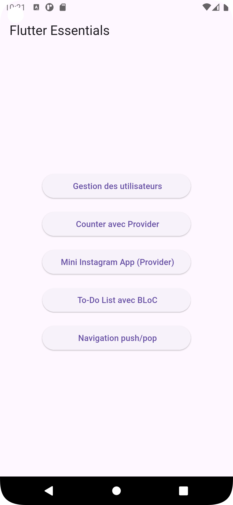
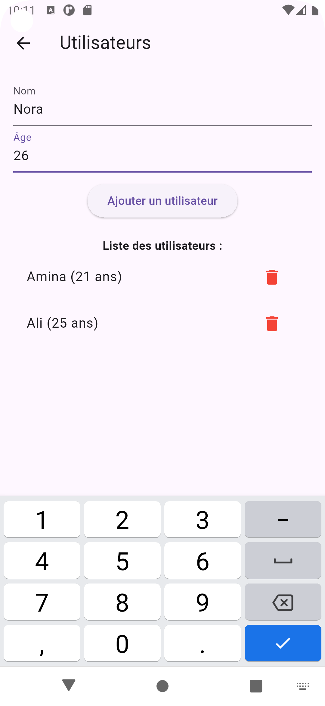
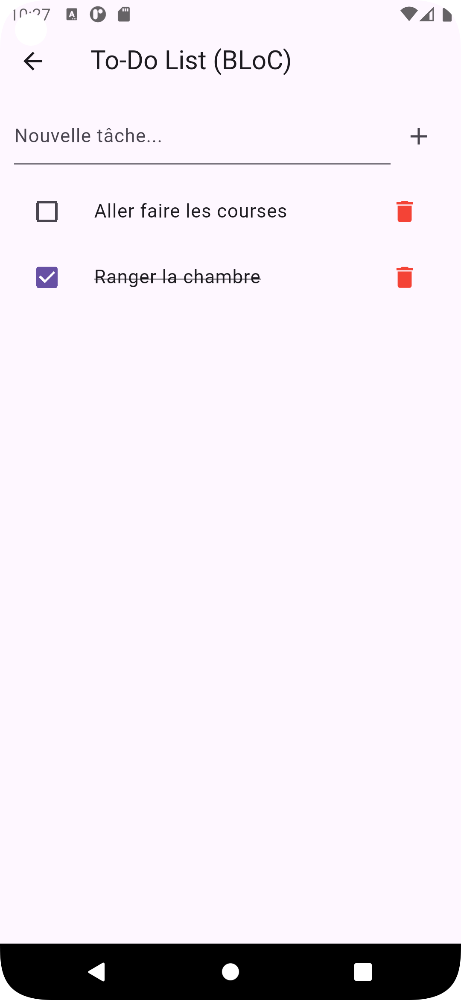

#  Flutter Essentials

Une application Flutter complète qui regroupe plusieurs fonctionnalités utiles pour maîtriser les concepts fondamentaux de Flutter : gestion des données locales, gestion d’état, architecture BLoC, et navigation entre écrans.

---

##  Fonctionnalités

###  1. Gestion des utilisateurs (SQLite)
- Ajouter, afficher et supprimer des utilisateurs.
- Stockage local avec la base de données SQLite.

###  2. Mini Instagram App (Provider)
- Affichage d'une liste de publications.
- Gestion des likes avec Provider.
- UI inspirée d’un flux de type Instagram.

###  3. To-Do List (BLoC)
- Ajouter, cocher et supprimer des tâches.
- Architecture BLoC : séparation claire entre UI et logique métier.
- Utilisation des événements et états.

###  4. Navigation entre écrans
- Navigation avec `Navigator.push` et `Navigator.pop`.
- Exemple simple de changement de page.

---

##  Architecture utilisée

- **Provider** : pour la gestion d’état simple.
- **BLoC** : pour une gestion d’état plus structurée.
- **SQLite** : pour la persistance des données localement.
- **Navigator** : pour la navigation entre les pages.
- **UUID** : pour générer des identifiants uniques dans la To-Do list.

---

## Captures d’écran 

### Page d'accueil

### Gestion des utilisateurs

### Mini instagram App 

### To-Do List

